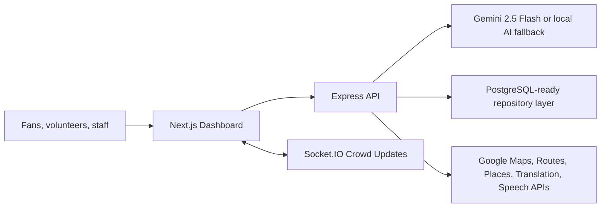

# StadiumMind AI

**The AI Operating System for Smart Stadiums**

StadiumMind AI is a production-style hackathon project for FIFA World Cup 2026 stadium operations. It combines a Next.js operations console, an Express API, real-time crowd updates, contextual AI reasoning, accessibility-aware routing, volunteer coordination, emergency response, and sustainability intelligence.

## Architecture



## Tech Stack

- Frontend: Next.js App Router, React, TypeScript, Tailwind CSS, Framer Motion, lucide icons
- Backend: Node.js, Express, TypeScript, Socket.IO
- AI: Gemini 2.5 Flash integration with deterministic local fallback
- Data: PostgreSQL-ready configuration with realistic mock operational data
- Security: Helmet, CORS, rate limiting, request validation, environment variables
- Testing: Vitest, Supertest, React Testing Library
- Deployment: Docker and Docker Compose

## Features

- AI Stadium Assistant with situation, reasoning, prediction, action, confidence, and source evidence
- Crowd Intelligence dashboard with gate occupancy, queue length, risk scoring, and heatmap
- Smart Navigation for fastest, least-crowded, accessible, and emergency routes
- Multilingual controls for English, Spanish, French, Hindi, Arabic, and Portuguese
- Organizer dashboard with alerts, volunteer status, medical requests, and AI recommendations
- Volunteer Copilot with task, priority, location, reason, and ETA
- Emergency Response panel with evacuation and announcement actions
- Sustainability dashboard for energy, water, waste, and carbon estimates
- Light and dark mode with keyboard-visible focus states

## Google APIs

The app is designed to use only Google APIs that improve the experience:

- Gemini API for operational reasoning
- Google Maps JavaScript API for venue map rendering
- Routes API and Distance Matrix API for routing
- Places and Geocoding APIs for location lookup
- Cloud Translation, Speech-to-Text, and Text-to-Speech for multilingual voice assistance
- reCAPTCHA v3 for public-facing form protection

The current build works with realistic mock data when API keys are not configured.

## Folder Structure

```text
backend/   Express API, AI service, real-time events, tests
frontend/  Next.js dashboard, UI components, tests
shared/    Shared TypeScript types and scoring utilities
docs/      Space for screenshots and architecture notes
```

## Installation

```bash
npm install
cp .env.example .env
npm run build
npm test
npm run accuracy
```

## Run Locally

```bash
npm run dev
```

- Frontend: http://localhost:3000
- Backend: http://localhost:4000/api/health

## Environment Variables

See `.env.example`.

- `GEMINI_API_KEY`: enables live Gemini 2.5 Flash responses
- `GOOGLE_MAPS_API_KEY`: enables Google Maps features
- `DATABASE_URL`: PostgreSQL connection string
- `JWT_SECRET`: authentication signing secret
- `FRONTEND_ORIGIN`: allowed browser origin for CORS

## Accuracy Score

The project includes a deterministic AI decision quality score. It checks whether AI output includes operational completeness, confidence, evidence sources, and stadium-specific details.

Current final score:

```json
{
  "finalAccuracyScore": 100,
  "passed": true
}
```

## Screenshots

Add final screenshots in `docs/screenshots/` after deployment or local browser capture.

## Future Improvements

- Persist event telemetry in PostgreSQL with migrations
- Add JWT login screens for role-based access
- Render a real Google stadium map once venue coordinates and API keys are available
- Add Web Speech API voice capture and playback in the browser
- Add Playwright end-to-end tests

## License

MIT
